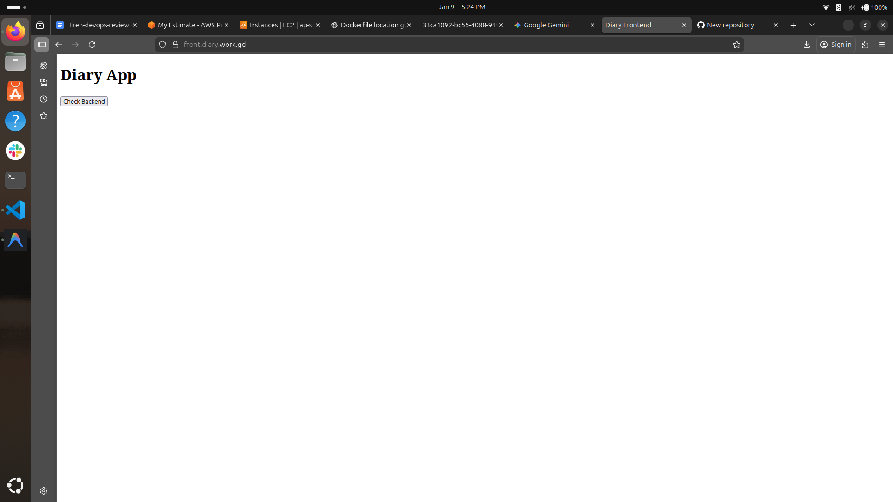

# Diary - Frontend Application

**Live Application:** [https://front.diary.work.gd](https://front.diary.work.gd)

This repository contains the static frontend for the Diary application. It is a lightweight, pure HTML/JS application designed to interact with the Diary backend.

## Project Structure

```
.
├── index.html          # Main entry point
├── app.js              # Application logic
├── architecture/       # Architecture diagrams
│   └── frontend-architecture.png
└── screenshots/        # Application screenshots
    ├── cloudfront-frontend-access.png
    └── dynamicreply.png
```

## Architecture

The frontend is hosted on **AWS S3** and served globally via **Amazon CloudFront** for low latency and secure HTTPS access.


## Screenshots

### Frontend Access via CloudFront


### Backend Interaction (Dynamic Reply)


## Local Setup

Since this is a static application, no build process is required.

### Prerequisites
- A modern web browser (Chrome, Firefox, etc.)
- Python 3 (optional, for running a local server)

### Running Locally

1. **Clone the repository:**
   ```bash
   git clone <repository-url>
   cd frontend
   ```

2. **Launch the application:**

   **Option A: Direct File Open**
   Simply verify the path and double-click `index.html` to open it in your browser.
   *Note: Some browser security policies might restrict API calls when running from `file://`.*

   **Option B: Python Simple HTTP Server (Recommended)**
   Run the following command in the project root:
   ```bash
   python3 -m http.server 8000
   ```
   Then open [http://localhost:8000](http://localhost:8000) in your browser.

## AWS Hosting Guide

This application is designed to be hosted serverlessly on AWS.

### 1. S3 Bucket Setup
1. Create a new **S3 Bucket** (e.g., `diary-frontend`).
2. Block all public access (recommended).
3. Enable **Bucket Versioning** (optional but recommended).

### 2. Upload Files
Upload the project files to the root of your S3 bucket. You can use the AWS Console or AWS CLI:

```bash
aws s3 cp index.html s3://your-bucket-name/
aws s3 cp app.js s3://your-bucket-name/
# Upload other assets if necessary
```

### 3. CloudFront Setup
1. Create a **CloudFront Distribution**.
2. Set the **Origin Domain** to your S3 bucket.
3. **Origin Access Control (OAC)**: 
   - Select "Origin Access Control Settings".
   - Create a new control setting (sign requests).
   - Update your S3 Bucket Policy to allow CloudFront access (CloudFront will provide the policy statement).
4. **Viewer Protocol Policy**: Redirect HTTP to HTTPS.
5. **Default Root Object**: Set to `index.html`.

### 4. Verification
Once deployed, access your CloudFront distribution domain (e.g., `https://dxxxxx.cloudfront.net`). You should see the Diary App loaded securely.
